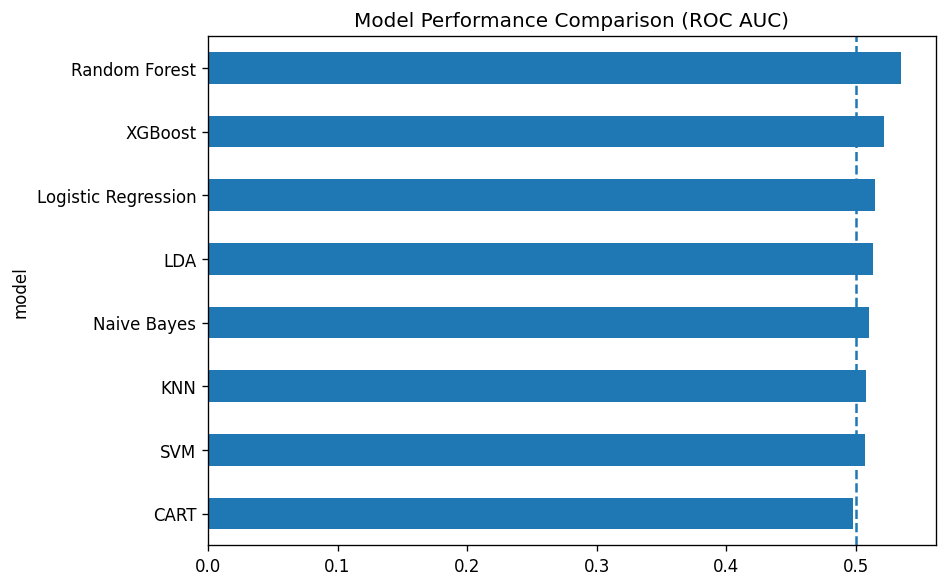

# Microsoft Stock Analytics & Predictive Modeling Dashboard

[](https://www.python.org/)
[](https://streamlit.io/)


**Course:** DAMO-611-5 Data Analytics Case Study 3  
**Institution:** University of Niagara Falls Canada  
**Project:** Data-Driven Analysis of Microsoft Stock Performance

---



## Problem Statement

This project evaluates whether historical Microsoft (MSFT) stock data can reveal actionable trading patterns through seasonal analysis, moving average crossover testing, market correlation analysis, and predictive classification modeling.

## Research Questions

| RQ | Focus | Method |
|---|---|---|
| **RQ1** | Monthly return seasonality | ANOVA |
| **RQ2** | 50-day / 200-day moving average crossover behavior | Crossover and forward returns |
| **RQ3** | MSFT relationship with QQQ | Pearson correlation |
| **RQ4** | Next-day direction prediction | ML classification and ROC AUC |

## Key Findings

- **RQ1:** Monthly return differences are not statistically significant.
- **RQ2:** Moving average crossovers show visual momentum shifts but limited predictive reliability.
- **RQ3:** MSFT has a strong positive relationship with QQQ daily returns.
- **RQ4:** Technical indicators provide limited next-day directional forecasting power.

## Repository Structure

```text
msft-stock-analytics-dashboard/
├── app/                  # Streamlit dashboard
├── data/                 # Raw and processed datasets
├── figures/              # Exported charts by analysis section
├── notebooks/            # Original notebooks
├── reports/              # Markdown technical documentation
├── src/                  # Reusable Python modules
├── tests/                # Pytest tests
├── tableau/              # Tableau packaged workbooks
├── README.md
└── requirements.txt
```

## Run Locally

```bash
python -m venv .venv
.venv\Scripts\activate
pip install -r requirements.txt
streamlit run app/Home.py
```

## Disclaimer

This project is for academic and portfolio purposes only. It is not financial advice, trading advice, or an investment recommendation.
